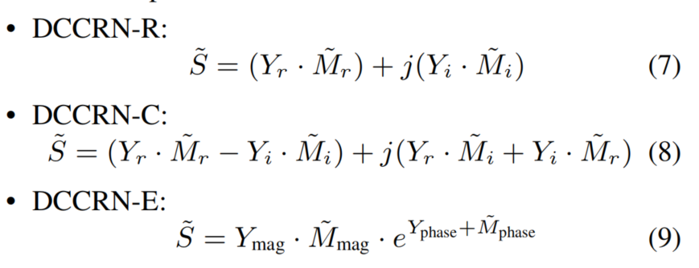

# DCCRN: Deep Complex Convolution Recurrent Network for Phase-Aware Speech Enhancement

## 期刊/会议
 Interspeech 2020

## Abs&Intro
1. 提出了复数卷积以及复数lstm，结合了crn和dcunet的优点，利用了复数乘法的特性
2. 参数量小、效率高

## Method
1. Framework

2. 复数卷积
  
复数卷积的W定义为：W_r+W_i*j ,其中 W_r 和 W_i 分别是实部卷积和虚部卷积的W  
模型的输入 X = X_r +j*X_i  
模型的输出  
  

3. 复数LSTM

4. 训练目标  
S 干净语音的实虚部， Y 带噪语音的实虚部  
  
    
提出了三种预测方式（mask乘在不同地方）  

6. Loss  
MES  

